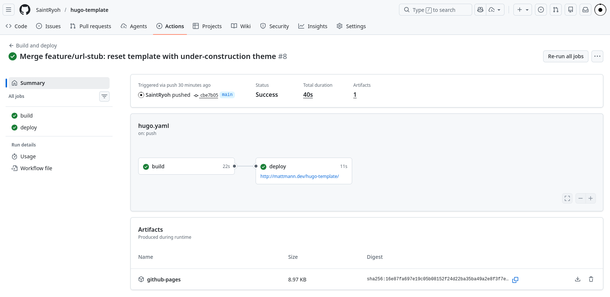
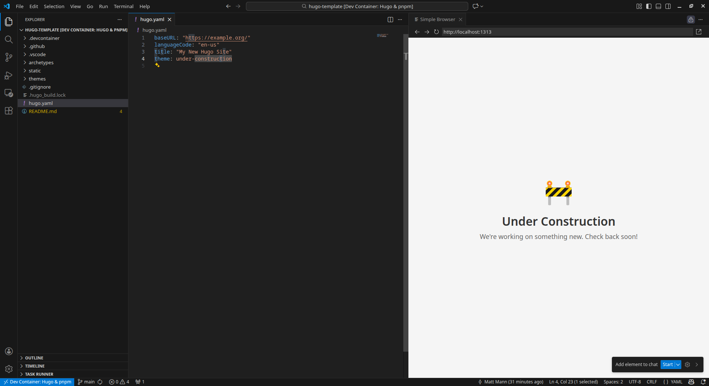

# Hugo Template

**Instant "Under Construction" site + ready-to-go dev environment.**

Use this template → point your domain → done. Your site is live with a professional placeholder while you build.



---

## ⚡ Quick Start (3 Steps)

### 1. Use This Template

Click the green **"Use this template"** button above, or [click here to create a new repo](https://github.com/new?template_name=hugo-template&template_owner=SaintRyoh).

### 2. Enable GitHub Pages

1. Go to your new repo's **Settings** → **Pages**
2. Under "Build and deployment", select **GitHub Actions**
3. The included workflow will automatically build and deploy your site

### 3. Point Your Domain (Optional)

Add your custom domain in **Settings** → **Pages** → **Custom domain**, or use the free `yourusername.github.io/repo-name` URL.

**That's it!** Your site is now live with an "Under Construction" page. 🚧

---

## 🛠️ Ready to Build? Open the Dev Environment

This template includes a complete dev container. Just open in VS Code or GitHub Codespaces:



Start the development server:

```bash
hugo server
```

Visit [http://localhost:1313](http://localhost:1313) to preview your site locally.

---

## Next Steps: Add a Real Theme

### 1. Choose a Theme

Browse the official Hugo themes gallery:

👉 **[https://themes.gohugo.io/](https://themes.gohugo.io/)**

### 2. Add It as a Git Submodule

```bash
git submodule add <theme-repo-url> themes/<theme-name>
```

**Example** (adding the PaperMod theme):

```bash
git submodule add https://github.com/adityatelange/hugo-PaperMod.git themes/PaperMod
```

### 3. Update Configuration

Edit `hugo.yaml` to use your new theme:

```yaml
baseURL: "https://your-site-url.com/"
languageCode: "en-us"
title: "Your Site Title"
theme: PaperMod  # Change this to your theme name
```

Each theme has its own configuration options—refer to the theme's documentation for details.

### 4. Add Content

Create your first post:

```bash
hugo new posts/my-first-post.md
```

### 5. Deploy

Just push to `main`—GitHub Actions handles the rest!

```bash
git add -A && git commit -m "Add new theme" && git push
```

---

## 🔄 Switching Back to Under Construction

Need to take your site offline temporarily? Simply change the theme in `hugo.yaml`:

```yaml
theme: under-construction
```

Push the change and your site instantly shows the placeholder again.

---

## Useful Commands

| Command | Description |
|---------|-------------|
| `hugo server` | Start development server with live reload |
| `hugo server -D` | Include draft content |
| `hugo new <path>` | Create new content |
| `hugo` | Build the site |

## Resources

- [Hugo Documentation](https://gohugo.io/documentation/)
- [Hugo Themes](https://themes.gohugo.io/)
- [Hugo Discourse Forum](https://discourse.gohugo.io/)
